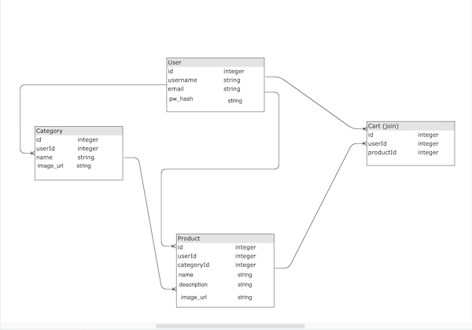
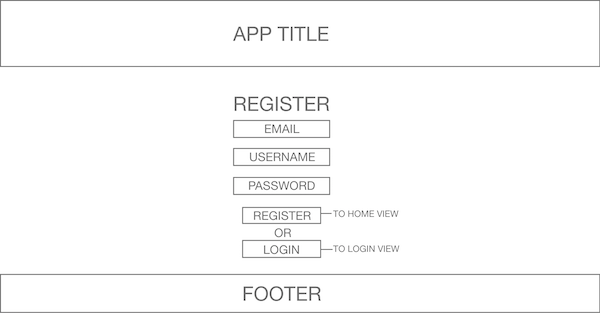
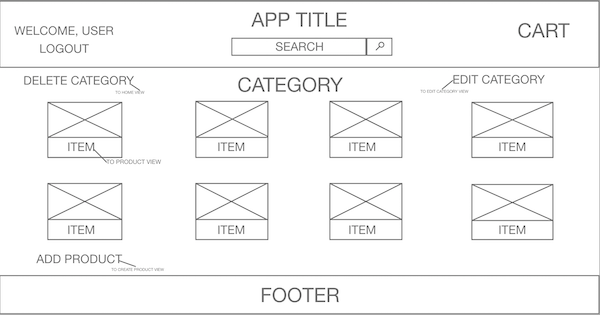
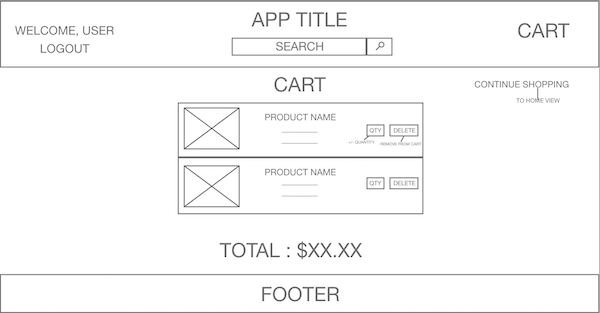

### Table of Contents
  - [Project Description](#project-description)
  - [Features List](#features-list)
  - [Entity Relationship Diagram (ERD)](#entity-relationship-diagram-erd)
  - [API Endpoint Documentation](#api-endpoint-documentation)
  - [Wireframes](#wireframes)
  - [Component Hierarchy](#component-hierarchy)
  - [Required Dependencies](#required-dependencies)

### Project Description
- An app geared towards high net worth individuals offering one of a kind luxury products, we will create an ecommerce platform that will allow a certain tier of the population to acquire the goods they need to showcase their superiority to the general population. Users will be able to search for and buy any product their minds can conceive of, from gold-leaf toilet paper (highly impractical) to a miniature giraffe (the definition of opulence, if I do say so myself), as well as view previously unheard - of ultra - lux items (read: saved from the pit of decadence that is the dark web), because we all know poor people's rules don't apply here...
  
##### Expected Challenges
- As a group, we all agree that the authorization and authentication portion of this application will present the most challenges. We decide to use this project as a learning experience. The entire group will complete this portion of functionality together, allowing those with a better grasp to practice explaining the technique to other and those still having difficulties to be caught up to speed.
  
- Another anticipated problem will be getting accustomed to the workflow that comes with collaborative coding. However, we have already taken steps to familiarize all members of the team with this process and we are already improving on this skill.
  
- We also anticipate that as the project grows, we will have to resist the urge to add features that may bring the app closer to our post - MVP goals, but are not necessary to bring this project to completion. To combat this, we have already made a clear distinction between features we absolutely must have and features we wish we could implement.
  
##### MVP 
- User can create an account.
- User is able to login and logout.
- User is able to save specific items in their shopping cart.
- User is able to see the total of all the products in cart, with total collected prices.
- User is able to search for an item through the name and or category.
- User is able to view specific product with image and description.
- User is able to increase the amount of a specific item before adding to cart.
  
  
##### POST MVP
Functional Checkout

### Features List

E-commerce application that allows the user to search an item by category and item name.

Top of the navbar will be the name of the actual app.

In the middle of the nav bar in the app is a search bar that can either search by item name.

User opens up the app and is able to either login if they already have a user name or register a username and password.

To the left of the search bar is a link to logout accompanied by a greeting for the user.

To the right of the search bar is the cart.

When the user successfully registers or logs in, the user is redirected to the home page

When logged in the user can search for an item.

The item that is searched for is pulled up and rendered unto the page with a brief description aswell as a price and image for said product. Along with a quantity number that can be changed and an add to cart button.

At the bottom of each product page there will be similar/ related items to the currently viewed product.

Add to cart icon on the right side of the header brings you to Cart page.

The cart page shows a list of all the items that have been added to the cart aswell as their quantity, image, brief description and total price of all the items.

### Entity Relationship Diagram (ERD)

### API Endpoint Documentation

  #### Users 
  -  login a user (POST)  
   request: '/login', {username, password}  
   response: {{userinfo}, token }

  - register a user (POST) 
    request: '/register', {username, password, email}  
    response: {{userinfo}, token}

  #### Categories
  - Create a category (POST) 
    Request: '/categories', {name, image_url} 
    Response: {name, image_url}   
  - List all categories (GET) 
    Request: '/categories', {options} 
    Response: {categories}  
  - List one category by id (GET)  
    Request: '/categories/:id', {id}  
    Response {category}  
  - Update a category (PUT)  
    Request: '/categories/:id', {name, image_url} 
    Response: {name, image_url}  
  - Delete a category (DELETE) 
    Request: '/categories/:id', {id} 
    Response: deletion message  

  #### Products
  - Create a product (POST) 
    Request: '/products' , {name, description, image_url} 
    Response: {name, description, image_url}   
  - List all products (GET) 
    Request: '/products', {options} 
    Response: {products}  
  - List one product by id (GET)  
    Request: '/products/:id', {id}  
    Response {product}  
  - Update a product (PUT)  
    Request: '/products/:id' , {name, description, image_url} 
    Response: {name, description, image_url}  
  - Delete a product (DELETE) 
    Request: '/products/:id', {id} 
    Response: deletion message  

### Wireframes

  ##### Login View
  

  ##### Register View
   

  ##### Home View
  

  ##### Search Results View
  

  ##### Category View
  

  ##### Create Category View
  

  ##### Edit Category View
  

  ##### Product View
  

  ##### Create Product View
  

  ##### Edit Product View
  

  ##### Cart View
  

### Component Hierarchy

##### Login
  

##### Register
  

##### Home
  

##### Search Results

##### Category
  

##### Create Category
  

##### Edit Category
  

##### Product
  

##### Create Product
  

##### Edit Product
  

##### Cart
  
 

### Required Dependencies
- [Express](https://www.npmjs.com/package/express), for easy server initialization.
- [Cors](https://www.npmjs.com/package/cors), to expose middleware that can be used to enable CORS with various options.
- [Body-Parser](https://www.npmjs.com/package/body-parser), to expose middleware that can be used to parse incoming request bodies before your server route handlers.
- [Axios](https://www.npmjs.com/package/axios), to enable promise - based HTTP requests to our Express server.
- [Morgan](https://www.npmjs.com/package/morgan), to expose middleware that can be used to log HTTP requests to our Express server.
- [Nodemon](https://www.npmjs.com/package/nodemon), to allow for automatic restarting of our Express server during development.
- [PG](https://www.npmjs.com/package/pg), a PostgreSQL client for Node.js.
- [Sequelize](https://www.npmjs.com/package/sequelize), a promise based Node.js ORM tool for PostgreSQL.
- [React-Router-DOM](https://www.npmjs.com/package/react-router-dom).